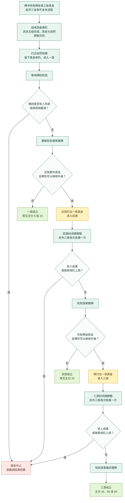

# 120 张厦门麻将：双游与三游流程（中间稿）

> 状态：供后续讨论与规则引擎修订参考；情景实验室已有双游交互演示。
> 保存日期：2026-08-13。

## 当前采用的表达口径

- 起手三张真金属于“三金倒”，优先检查并立即结算，不进入本图流程。
- 正常摸打阶段形成三张真金，不能直接按三金倒结束；须先形成游金，再经过双游升级到三游。
- 双游和三游各进入一轮封闭摸牌圈；其余三家依次获得最后一次摸牌机会。
- 封闭圈内，他家是否可暗杠、杠上胡或用其他方式截游，属于开局前必须确定的房规。
- 一游常见主分为 8 或 10，双游常见 20，三游常见 40、60 或 80；具体档位须开局固定。
- 此图是教学流程稿，不作为唯一的厦门统一规则；后续若采用到网页，应继续标明“共同骨架”与“房规分歧”。

## 与当前独立仓库的关系

- 当前 120 张实现默认使用：游金 10、双游 20、三游 80。
- 当前规则引擎已实现牌中双金必须游、三金必须先双游，以及双游/三游封闭摸牌圈。
- 网页落图前仍需确认：三游是否需要第二轮封闭摸牌圈，以及封闭圈内允许哪些截游动作。
